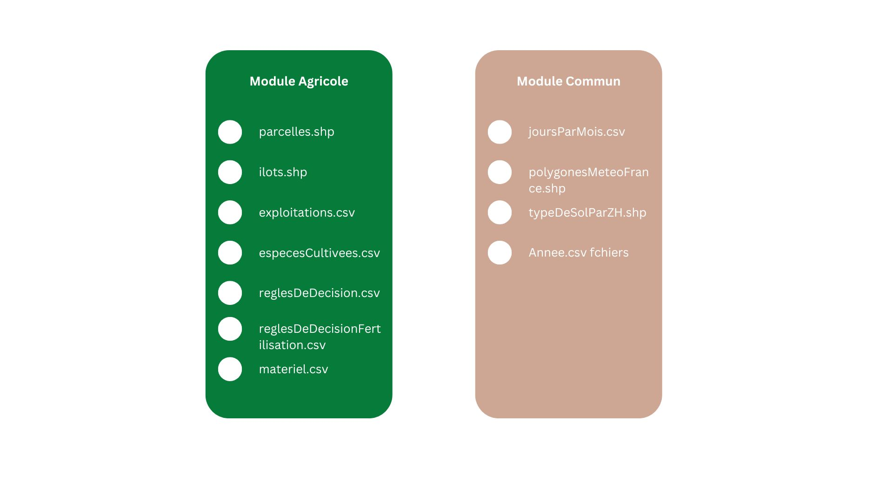

# Instanciation du territoire de Diohine dans MAELIA

Ce dépôt regroupe les outils, scripts et documents nécessaires à l’instanciation du territoire de Diohine dans la plateforme de simulation MAELIA (GAMA).

## Présentation

MAELIA est une plateforme de simulation multi-agents dédiée à la modélisation des systèmes agro-environnementaux.  
Ce projet vise à organiser les données brutes, les traiter, et les structurer dans le format attendu par MAELIA (répertoires modeleAgricole et modeleCommun).

## Structure du dépôt

- `data/` — Données brutes (fichiers shapefile, exports CSV, autres fichiers sources).
- `notebooks/` — Notebooks jupyters
- `scripts/` — Scripts de traitement et de formatage des données.
- `diohine/` — Données prêtes pour MAELIA :
  - `modeleAgricole/`
  - `modeleCommun/`
- `docs/` — Documentation, notes et guides méthodologiques.
- `issues/` — Suivi des problèmes rencontrés et tâches à réaliser.

## Étapes d’instanciation

1. **Collecte des données :** Rassembler toutes les données nécessaires (météo, sol, exploitants, irrigation, îlots, parcelles, etc.).
2. **Formatage des données :** Respecter les spécifications MAELIA :
   - Utilisation du séparateur `;` pour les fichiers CSV.
   - Les décimales sont toujours des `.`.
   - Respect de l’ordre et des intitulés des colonnes.
   - Encodage UTF-8 (sans BOM).
   - Ne pas modifier les fichiers `.dbf` avec Excel (privilégier R ou QGIS).
   - Ne pas modifier les fichiers `.csv` avec Excel (privilegier R ou Pyhton).
3. **Structuration des données :**
   - Traiter les données brutes avec les scripts du dossier `scripts/`.
   - Organiser les résultats dans `diohine/modeleAgricole/` et `diohine/modeleCommun/`.
4. **Validation :**
   - Vérifier la conformité des fichiers d’entrée.
   - Effectuer des tests d'intégration dans MAELIA (via GAMA).

Les détails sur les exigences, les bonnes pratiques et les erreurs courantes sont disponibles dans la [Documentation](docs/).

Les points d'attention sont disponibles [ici](issues/)

## Checklist des Données

Voici la liste des fichiers nécessaires pour l’instanciation :

### 📂 Module Agricole (`modeleAgricole/`)

- `parcelles.shp`
- `ilots.shp`
- `exploitations.csv`
- `especesCultivees.csv`
- `reglesDeDecision.csv`
- `reglesDeDecisionFertilisation.csv`
- `materiel.csv`

### 📂 Module Commun (`modeleCommun/`)

- `joursParMois.csv`
- `polygonesMeteoFrance.shp`
- `typeDeSolParZH.shp`
- Fichiers météo par année (`Annee.csv`)

---

### Schéma visuel de la checklist

---

## Feuille de route

- [ ] Rassembler les données brutes dans `data/`
- [ ] Développer les scripts de traitement
- [ ] Générer et organiser les fichiers finaux dans `diohine/`
- [ ] Valider les fichiers dans MAELIA
- [ ] Documenter les problèmes et solutions rencontrés